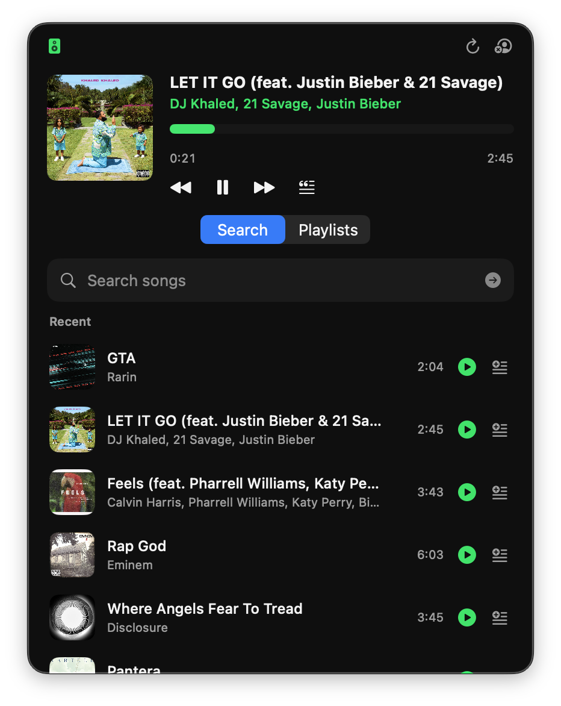
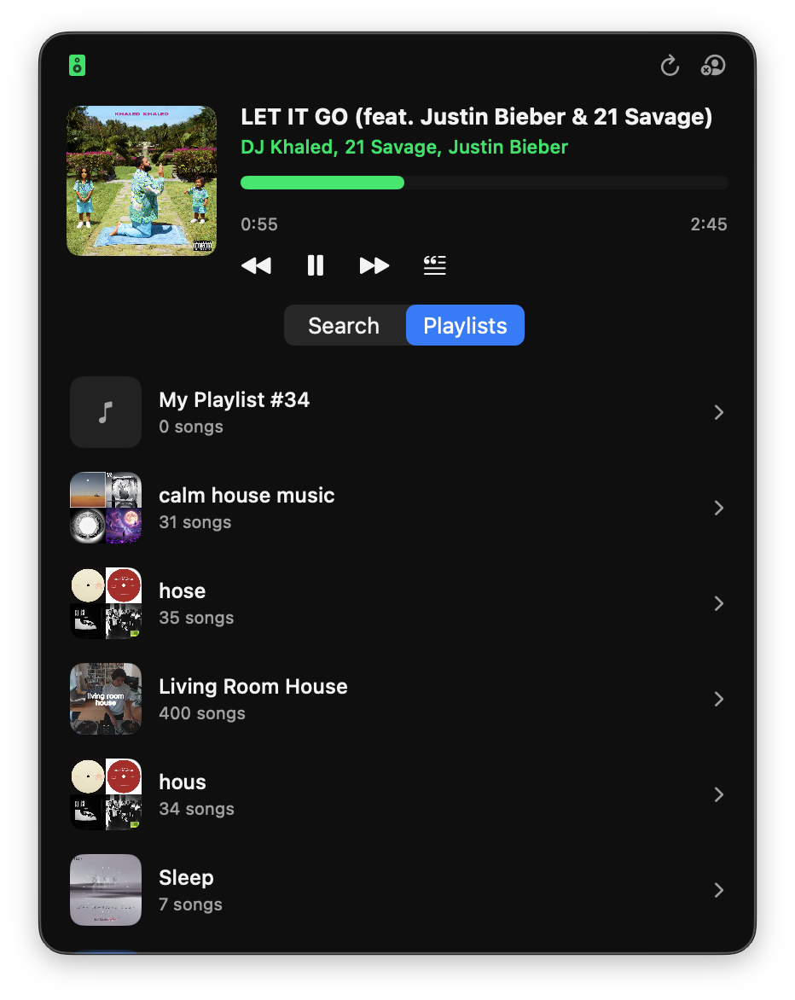

# MenuBarSpotify

A tiny macOS menu-bar Spotify player. It lives in the menu bar, uses Spotify's
Web Playback SDK as its own Spotify Connect device, and keeps the full Spotify
desktop app out of the way.

## Motivation

I listen to songs, but Spotify is bloated.

This is enough:

- search songs
- browse playlists
- play through a menu-bar player
- seek, pause, skip, and resume
- add tracks to the Spotify queue
- show recent tracks in Search
- show lyrics when I want to jam

On my machine, this uses about **8x less RAM** than the full Spotify app. What more do I need?

## How It Works

The app uses:

- Spotify Web API for search, playlists, devices, queueing, recent tracks, and playback commands.
- Spotify Web Playback SDK inside a hidden `WKWebView` for actual audio playback.
- LRCLIB for lyrics.

The Web Playback SDK creates a Spotify Connect device called `MenuBar Spotify`.
Spotify.app does not need to be open.

## Requirements

- macOS with Xcode installed.
- A Spotify Developer app.
- Spotify Premium for playback through this app. Spotify's Web Playback SDK emits an account error when the signed-in user does not have Premium.
- A Spotify account that has access to the playlists/tracks you want to play.

Without Premium, authentication and some Web API reads may still work, but the
menu-bar player cannot stream songs through the Web Playback SDK.

## Spotify App Setup

1. Open the [Spotify Developer Dashboard](https://developer.spotify.com/dashboard).
2. Create an app.
3. Copy the app's client ID and client secret.
4. Add this redirect URI to the app settings:

```text
spotify-menubar://callback
```

The redirect URI must match exactly. If Spotify shows `redirect_uri: Not matching configuration`, fix it in the Developer Dashboard or in `.config`.

## Local Config

Create `.config` in the project root:

```env
SPOTIFY_CLIENT_ID=your_client_id
SPOTIFY_CLIENT_SECRET=your_client_secret
SPOTIFY_REDIRECT_URI=spotify-menubar://callback
```

After sign-in, the app writes refreshed token fields back into the same file:

```env
SPOTIFY_ACCESS_TOKEN=...
SPOTIFY_REFRESH_TOKEN=...
SPOTIFY_EXPIRES_AT=...
```

Do not commit `.config`.

You can override the config path with:

```bash
SPOTIFY_CONFIG_PATH=/path/to/spotify.config ./script/build_and_run.sh
```

## Run

```bash
./script/build_and_run.sh
```

For a build-only test:

```bash
./script/build_and_run.sh --verify
```

The app runs as a menu-bar-only macOS app.

## What Works

- Search songs and play a selected result.
- Browse playlists and play a playlist track in playlist context.
- Pause, resume, skip, previous, and seek.
- Add tracks from Search or Playlists to the Spotify queue.
- Pick the playback device from the menu-bar popover.
- Show recent tracks on the Search tab.
- Show synced or plain lyrics when LRCLIB has them.

## Queue And Playback Notes

- Search playback starts the selected track.
- Playlist playback starts from the selected track inside that playlist.
- Add to queue works from Search and Playlists.
- Queue viewing is not implemented yet.
- Spotify's Web API does not expose arbitrary queue remove/reorder controls.
- Playback devices come from Spotify Connect. You may see stale-looking devices if Spotify still reports them.

## Scopes

The app currently requests:

- `playlist-read-private`
- `playlist-read-collaborative`
- `user-read-playback-state`
- `user-read-currently-playing`
- `user-read-recently-played`
- `streaming`
- `user-modify-playback-state`

## Security Notes

This is a local hobby app. It currently uses the Authorization Code flow with a
client secret and stores tokens in `.config`.

## Resource Usage

A quick local snapshot (using RSS from `ps`, not a full Instruments benchmark) while `MenuBarSpotify` was playing and `Spotify.app` was open but idle:


| App                | Processes | RSS Memory | CPU                             |
| ------------------ | --------- | ---------- | ------------------------------- |
| **MenuBarSpotify** | 1         | ~129 MB    | ~1.4% - 5.6% (song was playing) |
| **Spotify.app**    | 7         | ~1.02 GB   | ~0.0% - 2.0%                    |


- **Memory Ratio**: ~7.9x less RAM (about **8x**).
- **Process Breakdown**: Spotify spawns 7 helper processes (main app, renderer, GPU, network, storage, crashpad, media/CDM). `MenuBarSpotify` runs entirely in a single process.
- **CPU**: `MenuBarSpotify` handles actual playback, so its CPU is slightly higher during active playing compared to an idle Spotify desktop app.

## References

- [Spotify Web Playback SDK](https://developer.spotify.com/documentation/web-playback-sdk)
- [Spotify Web Playback SDK reference](https://developer.spotify.com/documentation/web-playback-sdk/reference)
- [Spotify Web API queue endpoint](https://developer.spotify.com/documentation/web-api/reference/get-queue)
- [Spotify Web API](https://developer.spotify.com/documentation/web-api)

## Screenshots

**Search**



**Playlists**


