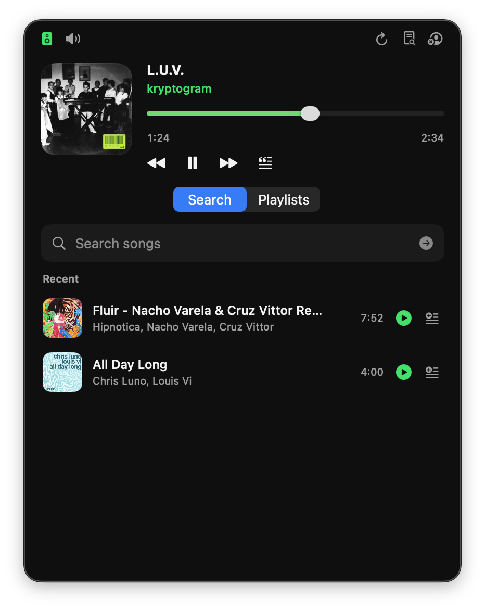
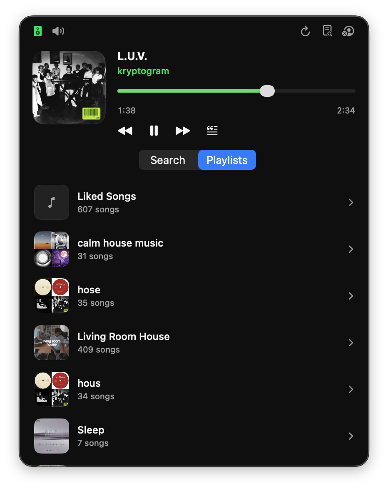
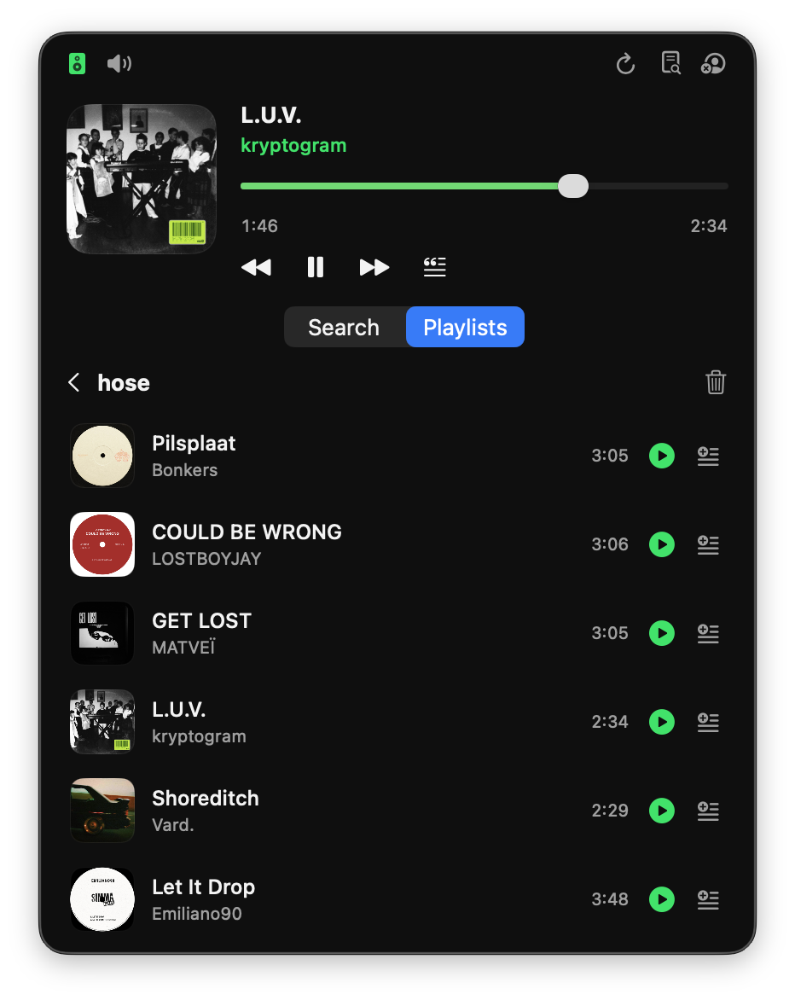

# MenuBarSpotify

A small Spotify player for the macOS menu bar. It plays audio through its own
Spotify Connect device, so the Spotify desktop app does not need to be open.

## Features

- Search tracks and reopen recently played songs
- Browse playlists and play tracks in playlist context
- Pause, resume, skip, seek, and switch Spotify Connect devices
- Add tracks to the Spotify queue
- Show synced or plain lyrics from LRCLIB
- Run as a menu-bar-only app

Spotify Premium is required for playback through the Web Playback SDK.

## Screenshots

### Search



### Playlists



### Playlist detail



## Requirements

- macOS 14 or later
- Xcode
- A Spotify Developer app
- A Spotify Premium account

## Spotify developer setup

1. Create an app in the [Spotify Developer Dashboard](https://developer.spotify.com/dashboard).
2. Copy its client ID.
3. Add this redirect URI:

```text
spotify-menubar://callback
```

The redirect URI must match exactly in Spotify and `.config`.

## Configuration

Create `.config` in the repository root:

```env
SPOTIFY_CLIENT_ID=your_client_id
SPOTIFY_REDIRECT_URI=spotify-menubar://callback
```

After sign-in, the app stores its access token, refresh token, and expiry in the
same file. `.config` is ignored by Git and should stay local.

To use a config file elsewhere:

```bash
SPOTIFY_CONFIG_PATH=/path/to/spotify.config ./script/build_and_run.sh
```

## Build and run

Build and launch a temporary app bundle:

```bash
./script/build_and_run.sh
```

Install `MenuBarSpotify.app` in `~/Applications`:

```bash
./script/build_and_run.sh install
```

Build, launch, and confirm that the process stays alive:

```bash
./script/build_and_run.sh --verify
```

Run the playback regression tests:

```bash
swift test
```

## Playback model

The app uses the [Spotify Web API](https://developer.spotify.com/documentation/web-api)
for library data and remote commands. Audio and local playback state come from
the [Spotify Web Playback SDK](https://developer.spotify.com/documentation/web-playback-sdk),
which runs inside a persistent hidden `WKWebView`.

Authentication uses Authorization Code with PKCE. Tokens are stored only in the
local `.config` file.

## Limitations

- The queue can accept tracks, but Spotify's API does not support arbitrary
  queue removal or reordering.
- Spotify Connect may briefly report devices that are no longer available.
- Lyrics depend on LRCLIB coverage.
